# TGScripts

**PixInsight tools for astronomical image processing, by Thorsten Glebe.**

TGScripts brings together original scripts and enhanced versions of community tools for star reduction, mask creation, narrowband processing, intensity matching, deconvolution, and optical inspection. The collection also includes a starting point for developing your own PixInsight scripts.

[Installation](#installation) · [Script overview](#script-overview) · [Script gallery](#script-gallery) · [Help and troubleshooting](#help-and-troubleshooting) · [Credits and license](#credits-and-license)

## Installation

Install through PixInsight's update system to receive the scripts and their bundled documentation.

1. Open **Resources → Updates → Manage Repositories**.
2. Add this repository URL:

   ```text
   https://norman123al.github.io/TGScripts/TGScripts_repository/
   ```

3. Select **Resources → Updates → Check for Updates** and install the available TGScripts update. Restart PixInsight if prompted to complete installation.
4. Open a script from **Script → TG Scripts**. ROI Linear Fit appears under the menu label **ROI Linear Fit**.

<details>
<summary>Show installation screenshots</summary>

**Manage repositories**

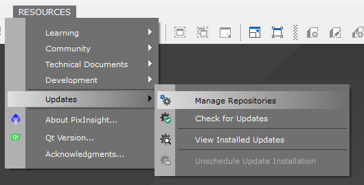

**Check for updates**

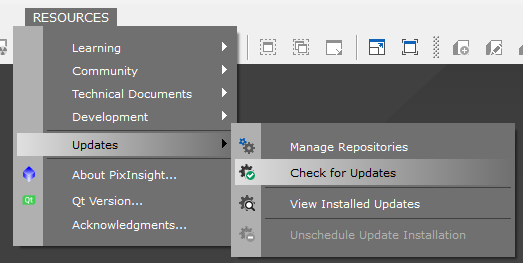

</details>

### Requirements

- **PixInsight:** scripts run inside PixInsight using its JavaScript Runtime (PJSR).
- **ROI Linear Fit and Star Spike Protection Mask:** use PixInsight **1.9.5 or later with the V8 scripting engine**. Star Spike Protection Mask targets and was tested with 1.9.5. Older scripts have their own requirements; LocalSupportMask and TGScriptSkeleton explicitly require at least 1.8.9-1.
- **BBStarReduction:** requires [StarXTerminator](https://www.rc-astro.com/resources/StarXTerminator/) to be installed and configured with an AI model. The script requires an image or preview of at least **256 × 256 pixels**.

The update manifest accepts a broader range of PixInsight versions than the two V8 scripts support. Being offered the package by the updater does not establish compatibility with every script.

## Script overview

| Task | Script | What it does |
| --- | --- | --- |
| Inspect image quality | [AberrationInspectorTG](#aberrationinspectortg) | Builds a configurable grid of image crops for comparing stars across the field. |
| Compare corners | [AberrationSpotterTG](#aberrationspottertg) | Combines the four corners and, optionally, the center in one inspection image. |
| Reduce stars | [BBStarReduction](#bbstarreduction) | Applies Bill Blanshan's three star reduction methods, with parameter previews. |
| Select colors | [ColorMaskTG](#colormasktg) | Creates masks from hue, intensity, and saturation ranges. |
| Isolate emission | [CSTG](#cstg) | Subtracts the broadband continuum contribution from a narrowband image. |
| Enhance dark detail | [DarkStructureEnhanceTG](#darkstructureenhancetg) | Increases the visibility of dark structures such as dust lanes. |
| Tune deconvolution | [DeconvolutionPreviewTG](#deconvolutionpreviewtg) | Compares deconvolution results across synthetic point spread function settings. |
| Combine narrowband and RGB | [EmissionLineIntegrationTG](#emissionlineintegrationtg) | Adds continuum-subtracted narrowband emission to RGB channels. |
| Support deconvolution | [LocalSupportMask](#localsupportmask) | Generates a local support mask for deconvolution deringing. |
| Match intensity scales | [ROI Linear Fit](#roi-linear-fit) | Measures a fit in a selected region and applies it to the full target image. |
| Protect diffraction spikes | [Star Spike Protection Mask](#star-spike-protection-mask) | Builds a soft mask protecting bright stellar cores and their spikes. |
| Develop scripts | [TGScriptSkeleton](#tgscriptskeleton) | Provides a reusable dialog, image preview, and process-instance framework. |

## Script gallery

Each entry links to its source file. Most scripts also provide a documentation button in PixInsight; the bundled guides contain parameter details and examples. Screenshots show actual script interfaces, with some taken from earlier releases. Expand an interface below to view it.

### AberrationInspectorTG

Creates an **n × n mosaic** of crops sampled across an image, including its corners, edges, and center. Use it to compare star shapes and assess field-dependent aberrations without navigating a large image. The TG version supports panels up to **2048 × 2048 pixels** and saving settings as a process icon.

Based on Mike Schuster's AberrationInspector. [Source](TGScripts_repository/src/scripts/TGScripts/AberrationInspectorTG.js)

<details>
<summary>View AberrationInspectorTG interface</summary>

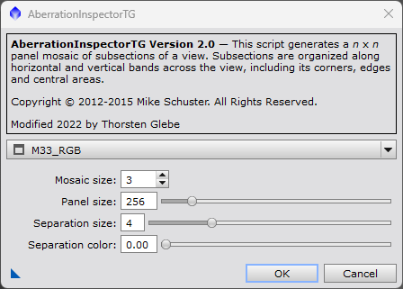

</details>

### AberrationSpotterTG

Collects the **four corners of the active image**, with an optional center crop, into a single inspection image. Set the horizontal and vertical crop sizes, spacing, and background brightness to make comparisons easier. The TG version supports crops up to **2048 × 2048 pixels** and reusable process icons.

Based on David Serrano's AberrationSpotter. [Source](TGScripts_repository/src/scripts/TGScripts/AberrationSpotterTG.js)

<details>
<summary>View AberrationSpotterTG interface</summary>

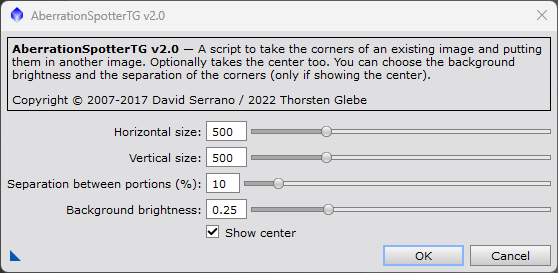

</details>

### BBStarReduction

Reduces the prominence of stars in a **stretched image** using Bill Blanshan's **Transfer, Halo, or Star** method. It automates starless-image generation with StarXTerminator and offers a preview for comparing reduction settings before applying them to the target.

Requires StarXTerminator; see [troubleshooting](#starxterminator-io-error-in-bbstarreduction) if star removal fails. [Source](TGScripts_repository/src/scripts/TGScripts/BBStarReduction.js)

<details>
<summary>View BBStarReduction interface</summary>

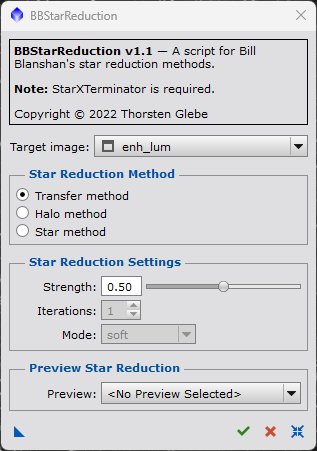

</details>

### ColorMaskTG

Creates masks that select a **color range**, refined by **intensity and saturation limits**. Choose a preset color or a custom hue interval, then control mask weighting, strength, and smoothing. The expanded options include chrominance, lightness, inverse lightness, and linear mask types for selective image adjustments.

Based on Rick Stevenson's ColorMask, with fixes and additional mask-generation controls. [Source](TGScripts_repository/src/scripts/TGScripts/ColorMaskTG.js)

<details>
<summary>View ColorMaskTG interface</summary>

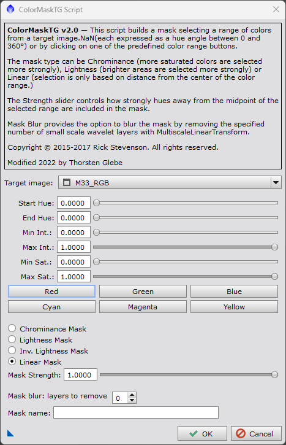

</details>

### CSTG

Performs **continuum subtraction** to separate emission-line signal from the continuum contribution in a narrowband image. Supply a grayscale narrowband image and a corresponding broadband image or RGB channel. Optional controls include a star mask, noise reduction, and diagnostic curves for the subtraction-factor evaluation.

Based on Hartmut V. Bornemann's CS script, with process-icon support and bundled documentation. [Source](TGScripts_repository/src/scripts/TGScripts/CSTG.js)

<details>
<summary>View CSTG interface</summary>

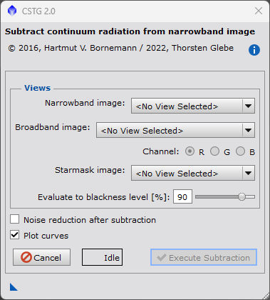

</details>

### DarkStructureEnhanceTG

Enhances **dark structures**, such as dust lanes, using a generated mask and adjustable enhancement strength and iterations. It can also extract the mask and preview the effect on a selected image preview. The bundled guide recommends linear data; the script warns when the selected image appears nonlinear.

Based on DarkStructureEnhance by Carlos Sonnenstein and Oriol Lehmkuhl, with preview and process-icon support. [Source](TGScripts_repository/src/scripts/TGScripts/DarkStructureEnhanceTG.js)

<details>
<summary>View DarkStructureEnhanceTG interface</summary>

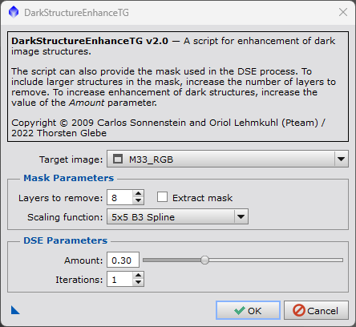

</details>

### DeconvolutionPreviewTG

Generates a comparison of deconvolution results while varying the **sigma and shape of a synthetic point spread function (PSF)**. Work on a PixInsight image preview to inspect a representative region at a useful scale. Controls include deconvolution iterations, deringing, and a local support mask; the current settings can also be applied to the selected preview.

Based on Juan M. Gómez's DeconvolutionPreview, adapted for preview-based evaluation and process-icon workflows. [Source](TGScripts_repository/src/scripts/TGScripts/DeconvolutionPreviewTG.js)

<details>
<summary>View DeconvolutionPreviewTG interface</summary>

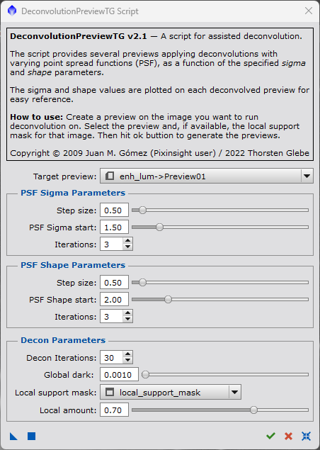

</details>

### EmissionLineIntegrationTG

Combines **narrowband emission with a broadband RGB image**. It estimates and subtracts the continuum contribution, then adds the emission signal to the selected RGB channels with independent amplification controls. Start with an active RGB image and corresponding, registered narrowband data for at least one channel. The dialog provides an image preview and options to retain the emission views.

Based on Hartmut V. Bornemann's EmissionLineIntegration, with changes to speed up continuum evaluation. [Source](TGScripts_repository/src/scripts/TGScripts/EmissionLineIntegrationTG.js)

<details>
<summary>View EmissionLineIntegrationTG interface</summary>

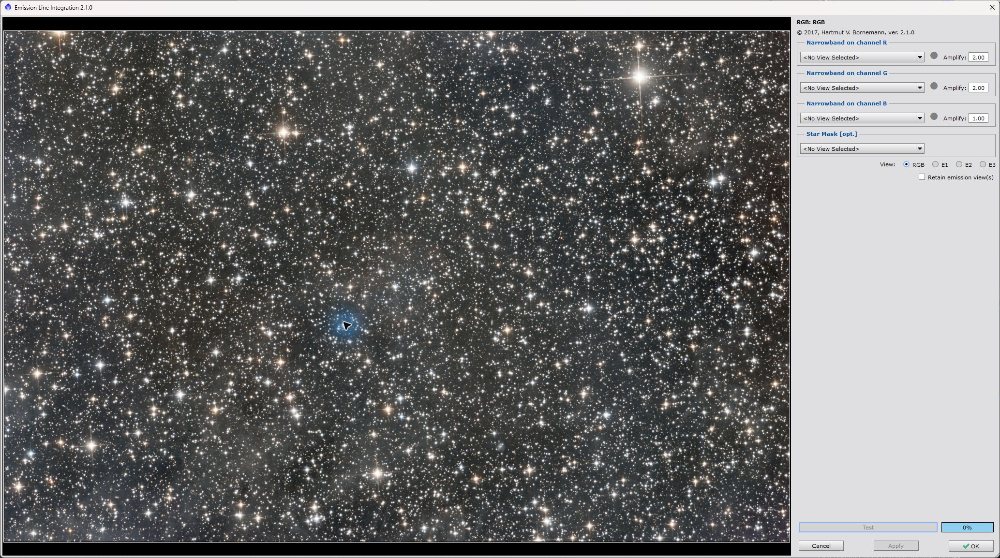

</details>

### LocalSupportMask

Creates a **local support mask for deconvolution deringing**, helping protect stars during deconvolution. Adjust mask strength, scale, smoothness, and structure growth, then inspect the mask preview. Use a **linear main image**; both grayscale and RGB are supported, with luminance data recommended in the guide.

[Source](TGScripts_repository/src/scripts/TGScripts/LocalSupportMask.js)

<details>
<summary>View LocalSupportMask interface</summary>

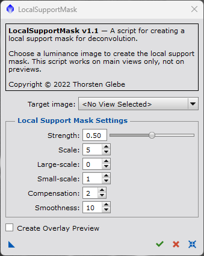

</details>

### ROI Linear Fit

Matches a target image's **intensity scale** to a reference using a rectangular **region of interest (ROI)**. The script measures PixInsight's native LinearFit transformation inside that region and applies it to the **entire target**, with separate fits for RGB channels. Enter coordinates or copy them from an existing preview; inspect the fit with a scatter plot before applying it.

Use two registered main images with identical dimensions and matching color types. The reference stays unchanged; the target is modified in place with Undo support. Requires PixInsight 1.9.5+ with V8. [Source](TGScripts_repository/src/scripts/TGScripts/ROILinearFit.js)

<details>
<summary>View ROI Linear Fit interface</summary>

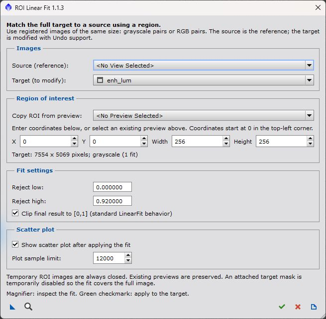

</details>

### Star Spike Protection Mask

Creates a **full-size grayscale protection mask for bright stars and diffraction spikes**. It follows the luminance profiles of stellar cores and spikes, with controls for star selection, spike detection, core size, mask growth, and blur. Preview the mask, compare it with the source, and optionally save the result as a 32-bit floating-point XISF image.

Designed for a **stretched stars-only image** with roughly straight spikes on two perpendicular axes. Detection uses actual pixel values, not the STF display stretch. **Black protects, white permits processing; apply the mask with Invert Mask off.** The source pixels remain unchanged. Requires PixInsight 1.9.5+ with V8. [Source](TGScripts_repository/src/scripts/TGScripts/StarSpikeProtectionMask.js)

<details>
<summary>View Star Spike Protection Mask interface</summary>

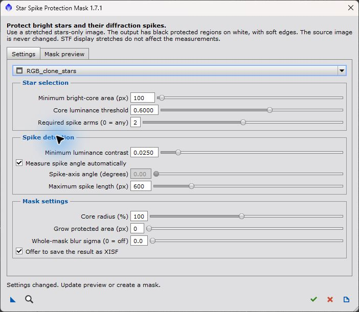

</details>

### TGScriptSkeleton

A **development template** for building PixInsight scripts. It provides image selection, a zoomable preview with display stretching, image statistics and properties, parameter storage in process icons, and standard reset, execution, and documentation controls. Use it as a starting point for a new tool rather than as an image-processing operation.

[Source](TGScripts_repository/src/scripts/TGScripts/TGScriptSkeleton.js)

<details>
<summary>View TGScriptSkeleton interface</summary>

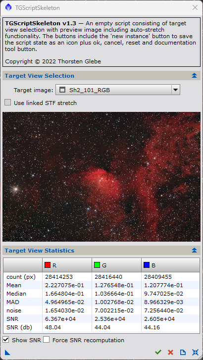

</details>

## Help and troubleshooting

### Documentation and reusable settings

Use a script's documentation or information button for parameter explanations and examples, where provided. The compiled guides are stored in [TGScripts_repository/doc/scripts](TGScripts_repository/doc/scripts). EmissionLineIntegrationTG currently has no separate bundled guide; refer to its interface tooltips and source comments.

Scripts with a **New Instance** triangle can store their settings in a PixInsight process icon. Save your process icons or project to reuse these settings in later sessions. Consult the individual guide before applying an instance to an image, since execution behavior varies by script.

### StarXTerminator I/O error in BBStarReduction

If BBStarReduction produces no visible reduction, check the PixInsight Process Console. For the documented StarXTerminator I/O error, **open the StarXTerminator process interface once**, then close it and retry BBStarReduction. You do not need to execute StarXTerminator manually. The workaround may need to be repeated after restarting PixInsight.

### Reporting a problem

Please [open an issue](https://github.com/norman123al/TGScripts/issues) with the script name and version, your PixInsight version and operating system, steps to reproduce the problem, and the relevant console error. Include whether the input is grayscale or RGB, linear or stretched, and a main image or preview.

## Repository layout

| Location | Contents |
| --- | --- |
| [TGScripts_repository/src/scripts/TGScripts](TGScripts_repository/src/scripts/TGScripts) | The 12 menu scripts. |
| [TGScripts_repository/src/scripts/TGScripts/lib](TGScripts_repository/src/scripts/TGScripts/lib) | Shared helpers and libraries used by the scripts. |
| [TGScripts_repository/doc/scripts](TGScripts_repository/doc/scripts) | Compiled PixInsight documentation and guide images. |
| [TGScripts_repository/images](TGScripts_repository/images) | Installation images and additional README screenshots. |
| [TGScripts_repository/updates.xri](TGScripts_repository/updates.xri) | PixInsight update manifest. |
| [TGScripts_docu](TGScripts_docu) | Documentation sources and generated documentation assets. |

The files in `lib/` support the menu scripts and are not standalone tools.

## Credits and license

Maintained by **Thorsten Glebe**. This collection includes original tools and adaptations of scripts by **Mike Schuster, David Serrano, Rick Stevenson, Hartmut V. Bornemann, Carlos Sonnenstein, Oriol Lehmkuhl, and Juan M. Gómez**. BBStarReduction implements star reduction methods by **Bill Blanshan**. Individual source files retain their original attribution and copyright notices.

The repository includes the [GNU General Public License v3.0](LICENSE). See individual source headers for applicable notices and terms. The software is provided without warranty.

Visit Thorsten's [astrophotography gallery on AstroBin](https://www.astrobin.com/users/norman123al/).
