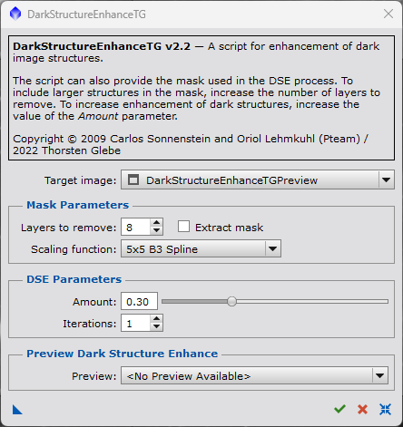

# TGScripts
Pixinsight scripts by Thorsten Glebe

This repository will provide Pixinsight scripts for astronomical image processing.
Use at your own risk.

Feel free to visit my astrophoto gallery on [Astrobin](https://www.astrobin.com/users/norman123al/). 

## Repository setup
The scripts will be provided in a dedicated subfolder (TG Scripts) of the Pixinsights SCRIPTS menu.

In order to add this repository to the Pixinsight update system, go to 'Manage Repositories' in the RESOURCES -> Updates menu

and add the following URL: **https://norman123al.github.io/TGScripts/TGScripts_repository/**.

Then run an update of Pixinsight system via the 'Check for Updates' menu item.

## Contained Pixinsight Scripts
This repository contains both new scripts written by me and existing scripts which I have reworked. Details on the scripts or the modifications w.r.t. the original versions are explained in the Pixinsight script documentation provided along with the scripts

### New Pixinsight Scripts
- **BBStarReduction.js** - a script to apply Bill Blanshan's star reduction methods (requires [StarXTerminator](https://www.rc-astro.com/resources/StarXTerminator/)).

  Known issues:
  - StarXTerminator might fail with an IO error (see console output) when exectued from the script. To solve this, start the StarXTerminator process manually once. Then the issue is gone until Pixinsight is closed. See also script documentation in Pixinsight.

- **LocalSupportMask.js** - a script to create a local support mask for Pixinsight's deconvolution process.

- **TGScriptSkeleton.js** - a script skeleton serving as a starting point for Pixinsight java script development.

### Modified Pixinsight Scripts
- **AberrationInspectorTG.js** - an improved version of the AberrationInspector script written by Mike Schuster. Added support for larger panel sizes and for icon set integration via "new instance" button. Added Pixinsight documentation.
- **AberrationSpotterTG.js** - an improved version of the AberrationSpotter script written by David Serrano. Added support for larger panel sizes and for icon set integration via "new instance" button. Added Pixinsight documentation.
- **ColorMaskTG.js** - an improved version of the ColorMask script written by Rick Stevenson with additonal mask generation capabilities. Added Pixinsight documentation.
- **CSTG.js** - a slightly modified version of the CS script written by Hartmut V. Bornemann. Added a "new instance" button and Pixinsight documentation.
  
- **DarkStructureEnhanceTG.js** - a slightly modified version of the DarkStructureEnhance script written by Carlos Sonnenstein and Oriol Lehmkuhl. Added a "new instance" button and Pixinsight documentation.

  

- **DeconvolutionPreviewTG.js** - an improved version of the DeconvolutionPreview script written by Juan M. Gómez. The script works now on image previews instead of main views, deconvolution parameters are provided and a "new instance" button as well as Pixinsight documentation was added.

  

